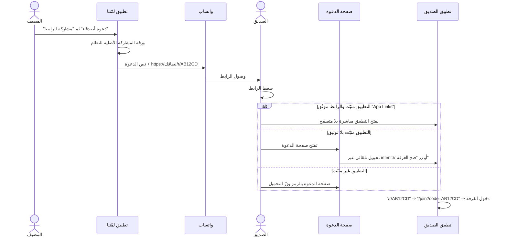

<div dir="rtl">

# روابط الدعوة · Deep Links

> **الهدف:** المضيف يضغط «مشاركة الرابط» → يختار واتساب (أو أي تطبيق) → يصل الرابط لأصدقائه →
> يضغط الصديق الرابط → **يفتح تطبيق لمّتنا على طول وينضم إلى الغرفة**.
> ومن لم يكن التطبيق عنده، تفتح له صفحة صغيرة فيها زرّ التحميل والرمز.

شكل الرابط:

```
https://<نطاقك>/r/AB12CD
```

---

## 1. كيف يعمل؟

</div>



<div dir="rtl">

داخل التطبيق:

| الطبقة | الملف | الدور |
|--------|-------|-------|
| المشاركة | `lib/services/share_service.dart` + `MainActivity.kt` | ورقة مشاركة النظام بلا أي حزمة خارجية |
| بناء الرابط | `lib/core/network/env.dart` → `Env.roomLink(code)` | `https://BASE/r/CODE` |
| استقبال الرابط | `android/app/src/main/AndroidManifest.xml` | `flutter_deeplinking_enabled` + مرشّحات VIEW |
| التوجيه | `lib/app/router.dart` | `/r/:code` ⇒ `/join?code=` (ويحفظ الرمز إن لم يكن مسجّلًا دخولًا) |
| صفحة الاحتياط | `landing/` | موقع ثابت صغير يفتح التطبيق أو يعرض التحميل |

> إن وصل الرابط قبل تسجيل الدخول، يُحفظ الرمز في `pendingInvite` ويُستأنف الدخول للغرفة
> **تلقائيًا** بعد إتمام تسجيل الدخول أو الدخول كضيف.

---

## 2. الإعداد — ٣ خطوات

### الخطوة ١: انشر مجلد `landing/` (مجاني)

اختر منصّة واحدة:

```bash
cd landing

# Vercel
npx vercel deploy --prod

# أو Netlify
npx netlify deploy --prod --dir=.

# أو Cloudflare Pages
npx wrangler pages deploy . --project-name lametna
```

ستحصل على نطاق مثل `https://lametna.vercel.app`.
عدّل `landing/config.js` وضع فيه رابط تحميل الـ APK.

### الخطوة ٢: اربط التطبيق بالنطاق

1. في `android/app/src/main/res/values/strings.xml` ضع نطاقك:

   ```xml
   <string name="app_link_host" translatable="false">lametna.vercel.app</string>
   ```

2. في `env.json` أضف السطر:

   ```json
   {
     "SUPABASE_URL": "https://lvlrhbsafzepnqawlmud.supabase.co",
     "SUPABASE_ANON_KEY": "sb_publishable_...",
     "APP_ENV": "prod",
     "APP_LINK_BASE": "https://lametna.vercel.app",
     "APP_DOWNLOAD_URL": "https://github.com/workabeer625-ai/Lametna/releases/latest"
   }
   ```

3. أعد البناء:

   ```powershell
   powershell -ExecutionPolicy Bypass -File tool\build_apk.ps1 -Clean
   ```

### الخطوة ٣ (موصى بها): افتح الرابط بلا متصفح إطلاقًا

هذه خطوة **App Links** الرسمية من جوجل؛ بدونها قد يفتح الرابط في المتصفح أولًا
ثم ينتقل للتطبيق (يعمل، لكنه أقل أناقة).

1. استخرج بصمة مفتاح التوقيع:

   ```powershell
   keytool -list -v -keystore F:\lametna-keystore.jks -alias lametna
   ```

   انسخ السطر `SHA256:` (٣٢ زوجًا مفصولة بنقطتين).

2. ضعها في `landing/.well-known/assetlinks.json` بدل `PUT_YOUR_RELEASE_SHA256_FINGERPRINT_HERE`.
3. أعد نشر `landing/` وتأكد أن الملف يُفتح فعلًا:

   ```
   https://نطاقك/.well-known/assetlinks.json
   ```

4. أعد تثبيت التطبيق؛ يتحقق أندرويد من الرابط تلقائيًا خلال ثوانٍ.

   للتحقق يدويًا على جهاز موصول:

   ```bash
   adb shell pm verify-app-links --re-verify app.lametna.lametna
   adb shell pm get-app-links app.lametna.lametna
   ```

---

## 3. اختبار سريع

```bash
# فتح رابط ويب كأن المستخدم ضغطه
adb shell am start -a android.intent.action.VIEW -d "https://نطاقك/r/AB12CD"

# فتح بالمخطط الخاص (يعمل دائمًا حتى بلا توثيق)
adb shell am start -a android.intent.action.VIEW -d "lametna://open/r/AB12CD"
```

يجب أن يفتح التطبيق على شاشة «انضمام بكود» والرمز مكتوب مسبقًا.

---

## 4. ماذا لو لم أنشر أي موقع؟

كل شيء يبقى يعمل:

- زرّ **«مشاركة الرابط»** يتحوّل تلقائيًا إلى مشاركة نصّ الدعوة بالرمز فقط
  (لأن `Env.hasLinkBase` = false).
- يبقى **المخطط الخاص** `lametna://open/r/CODE` فعّالًا لمن ثبّت التطبيق،
  لكن واتساب لا يجعل هذا النوع من الروابط قابلًا للنقر — لذلك يُنصح بنشر `landing/`.

---

## 5. حلّ المشكلات

| العَرَض | السبب | الحل |
|---------|-------|------|
| الرابط يفتح المتصفح ثم يظهر زرّ «فتح الغرفة» | `assetlinks.json` غير منشور أو البصمة خاطئة | أعد الخطوة ٣ وتأكد أن الملف يُفتح بنوع `application/json` |
| الرابط لا يفعل شيئًا على أندرويد ١٢+ | التحقق من الروابط فشل | `adb shell pm get-app-links app.lametna.lametna` ثم أعد التحقق |
| يفتح التطبيق على الرئيسية بدل الغرفة | الرمز غير صالح أو منتهٍ | الرمز ٦ خانات حروف/أرقام كبيرة، والغرفة تنتهي بعد ٣ ساعات خمول |
| صفحة ٤٠٤ عند `/r/AB12CD` | لم تُفعّل إعادة التوجيه في الاستضافة | Vercel: `vercel.json` · Netlify: `_redirects` · GitHub Pages: `404.html` (كلها موجودة في `landing/`) |
| «مشاركة الرابط» تنسخ بدل فتح الورقة | المنصّة لا تدعم القناة (iOS/سطح المكتب) | سلوك مقصود: النسخ إلى الحافظة احتياطيًا |
| الرابط بعد تسجيل الدخول يضيع | — | لا يضيع: يُحفظ في `pendingInvite` ويُستأنف تلقائيًا |

</div>
