

# مخططات التصميم · Design Diagrams

وثيقة التصميم الكاملة لتطبيق **لمّتنا**: من مخطط السياق إلى آخر آلة حالة.
كل المخططات مكتوبة بصيغة **Mermaid** وتُعرض تلقائيًا داخل GitHub بلا أدوات خارجية.

> كل مخطط هنا مستخرج من الكود الفعلي (`lib/`, `supabase/migrations/`) وليس تصوّرًا نظريًا.
> إن عدّلت الكود، عدّل المخطط المقابل في نفس الـ Pull Request.

## الفهرس

| # | المخطط | النوع | الغرض |
|---|--------|-------|-------|
| 1 | [مخطط السياق](#1-مخطط-السياق-context-diagram) | Context | من يتعامل مع النظام ومع ماذا |
| 2 | [حالات الاستخدام](#2-مخطط-حالات-الاستخدام-use-case-diagram) | Use Case | كل ما يستطيع كل فاعل فعله |
| 3 | [وصف حالات الاستخدام](#3-وصف-حالات-الاستخدام-التفصيلي) | Use Case Spec | السيناريوهات خطوة بخطوة |
| 4 | [معمارية النظام](#4-معمارية-النظام-component-diagram) | Component | الطبقات والمكوّنات |
| 5 | [معمارية التطبيق](#5-معمارية-تطبيق-flutter-package-diagram) | Package | تنظيم مجلدات Flutter |
| 6 | [مخطط الصفوف](#6-مخطط-الصفوف-class-diagram) | Class | نماذج البيانات والخدمات |
| 7 | [قاعدة البيانات](#7-مخطط-قاعدة-البيانات-erd) | ERD | الجداول والعلاقات |
| 8 | [آلة حالة الغرفة](#8-آلة-حالة-الغرفة) | State | دورة حياة الغرفة |
| 9 | [آلة حالة الجولة](#9-آلة-حالة-الجولة) | State | أطوار الجولة لكل نوع لعبة |
| 10 | [آلة حالة الحساب](#10-آلة-حالة-حساب-المستخدم) | State | ضيف ← حساب كامل |
| 11 | [آلة حالة الاتصال](#11-آلة-حالة-الاتصال-اللحظي) | State | Realtime وإعادة الاتصال |
| 12 | [تسلسل: المصادقة](#12-تسلسل-المصادقة-والدخول) | Sequence | دخول/تسجيل/ضيف |
| 13 | [تسلسل: ترقية الضيف](#13-تسلسل-ترقية-حساب-الضيف) | Sequence | ربط البريد بلا فقدان النقاط |
| 14 | [تسلسل: إنشاء غرفة ودعوة](#14-تسلسل-إنشاء-غرفة-ودعوة-الأصدقاء) | Sequence | الغرفة والمشاركة |
| 15 | [تسلسل: الانضمام](#15-تسلسل-الانضمام-إلى-غرفة) | Sequence | بكود أو من الغرف العامة |
| 16 | [تسلسل: دورة الجولة](#16-تسلسل-دورة-الجولة-الكاملة) | Sequence | القلب النابض للعبة |
| 17 | [تسلسل: المافيا](#17-تسلسل-ليل-ونهار-المافيا) | Sequence | الأدوار السرية |
| 18 | [تسلسل: الدردشة والإشراف](#18-تسلسل-الدردشة-والإبلاغ) | Sequence | الرسائل والبلاغات |
| 19 | [نشاط: دورة اللعب](#19-مخطط-النشاط-دورة-اللعب) | Activity | التدفق من الصفر للفوز |
| 20 | [خريطة التنقل](#20-خريطة-التنقل-navigation-map) | Navigation | كل الشاشات ومساراتها |
| 21 | [تدفق البيانات اللحظي](#21-تدفق-البيانات-اللحظي-realtime) | Data Flow | قنوات Realtime |
| 22 | [طبقات الأمان](#22-طبقات-الأمان-و-rls) | Security | من يرى ماذا |
| 23 | [مخطط النشر](#23-مخطط-النشر-deployment) | Deployment | أين يعمل كل شيء |
| 24 | [خريطة الألعاب](#24-خريطة-الألعاب-ومحركها) | Strategy | محرك الألعاب الـ25 |

---

## 1. مخطط السياق (Context Diagram)

يوضّح حدود النظام: من يستخدمه، وبماذا يتصل.

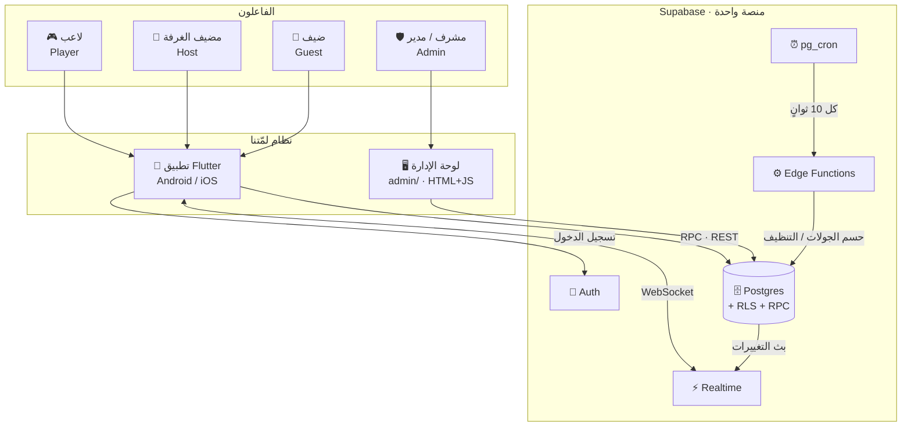
```mermaid
flowchart TB
    subgraph actors["الفاعلون"]
        P["🎮 لاعب<br/>Player"]
        H["👑 مضيف الغرفة<br/>Host"]
        G["👤 ضيف<br/>Guest"]
        A["🛡️ مشرف / مدير<br/>Admin"]
    end

    subgraph system["نظام لمّتنا"]
        APP["📱 تطبيق Flutter<br/>Android / iOS"]
        WEB["🖥️ لوحة الإدارة<br/>admin/ · HTML+JS"]
    end

    subgraph backend["Supabase · منصة واحدة"]
        AUTH["🔑 Auth"]
        DB[("🗄️ Postgres<br/>+ RLS + RPC")]
        RT["⚡ Realtime"]
        EF["⚙️ Edge Functions"]
        CRON["⏰ pg_cron"]
    end

    P --> APP
    H --> APP
    G --> APP
    A --> WEB

    APP -->|"RPC · REST"| DB
    APP -->|"تسجيل الدخول"| AUTH
    APP <-->|"WebSocket"| RT
    WEB --> DB

    CRON -->|"كل 10 ثوانٍ"| EF
    EF -->|"حسم الجولات / التنظيف"| DB
    DB -->|"بث التغييرات"| RT
```

**القاعدة الذهبية:** التطبيق لا يحسب نتيجة ولا يوزّع دورًا ولا يحدّد وقتًا.
كل قرار يُتخذ داخل Postgres بدوال `SECURITY DEFINER`، والعميل مجرّد عارض وملتقط إدخال.

---

## 2. مخطط حالات الاستخدام (Use Case Diagram)

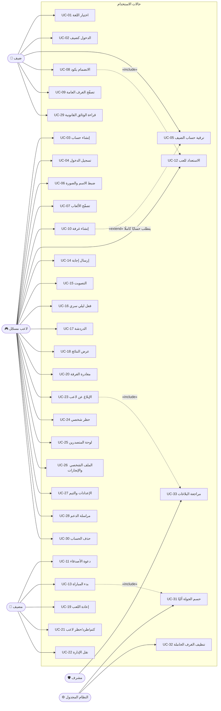
```mermaid
flowchart LR
    G(["👤 ضيف"])
    P(["🎮 لاعب مسجّل"])
    H(["👑 مضيف"])
    A(["🛡️ مشرف"])
    S(["⚙️ النظام المجدول"])

    subgraph UC["حالات الاستخدام"]
        direction TB
        U1["UC-01 اختيار اللغة"]
        U2["UC-02 الدخول كضيف"]
        U3["UC-03 إنشاء حساب"]
        U4["UC-04 تسجيل الدخول"]
        U5["UC-05 ترقية حساب الضيف"]
        U6["UC-06 ضبط الاسم والصورة"]
        U7["UC-07 تصفّح الألعاب"]
        U8["UC-08 الانضمام بكود"]
        U9["UC-09 تصفّح الغرف العامة"]
        U10["UC-10 إنشاء غرفة"]
        U11["UC-11 دعوة الأصدقاء"]
        U12["UC-12 الاستعداد للعب"]
        U13["UC-13 بدء المباراة"]
        U14["UC-14 إرسال إجابة"]
        U15["UC-15 التصويت"]
        U16["UC-16 فعل ليلي سري"]
        U17["UC-17 الدردشة"]
        U18["UC-18 عرض النتائج"]
        U19["UC-19 إعادة اللعب"]
        U20["UC-20 مغادرة الغرفة"]
        U21["UC-21 كتم/طرد/حظر لاعب"]
        U22["UC-22 نقل الإدارة"]
        U23["UC-23 الإبلاغ عن لاعب"]
        U24["UC-24 حظر شخصي"]
        U25["UC-25 لوحة المتصدرين"]
        U26["UC-26 الملف الشخصي والإنجازات"]
        U27["UC-27 الإعدادات والثيم"]
        U28["UC-28 مراسلة الدعم"]
        U29["UC-29 قراءة الوثائق القانونية"]
        U30["UC-30 حذف الحساب"]
        U31["UC-31 حسم الجولة آليًا"]
        U32["UC-32 تنظيف الغرف الخاملة"]
        U33["UC-33 مراجعة البلاغات"]
    end

    G --> U1 & U2 & U5 & U8 & U9 & U29
    P --> U3 & U4 & U6 & U7 & U10 & U12 & U14 & U15 & U16 & U17 & U18 & U20 & U23 & U24 & U25 & U26 & U27 & U28 & U30
    H --> U11 & U13 & U19 & U21 & U22
    A --> U33
    S --> U31 & U32

    U10 -.->|"«extend» يتطلب حسابًا كاملًا"| U5
    U8 -.->|"«include»"| U12
    U13 -.->|"«include»"| U31
    U23 -.->|"«include»"| U33
```

> **ملاحظة مهمة على الصلاحيات:** الضيف يرث كل ما يفعله اللاعب المسجّل **ما عدا**
> `UC-10 إنشاء غرفة`؛ عندها تظهر له شاشة «أكمل حسابك» التي تنفّذ `UC-05`.
> المضيف لاعب مسجّل بصلاحيات إضافية داخل غرفته فقط.

---

## 3. وصف حالات الاستخدام التفصيلي

### UC-10 · إنشاء غرفة

| العنصر | الوصف |
|--------|-------|
| **الفاعل** | لاعب مسجّل (حساب كامل) |
| **الهدف** | إنشاء غرفة جديدة بلعبة محدّدة ورمز دعوة |
| **الشرط المسبق** | مسجّل دخول · ليس ضيفًا · أقل من غرفتين مفتوحتين |
| **المشغّل** | ضغط «إنشاء غرفة» من الرئيسية أو من بطاقة لعبة |
| **المسار الأساسي** | 1. اختيار اللعبة ← 2. ضبط العنوان والخصوصية وعدد اللاعبين والجولات ← 3. تأكيد ← 4. `create_room()` ← 5. فتح شاشة الغرفة برمز من 6 خانات |
| **مسارات بديلة** | أ. ضيف ← شاشة «إنشاء الغرف يحتاج حسابًا كاملًا» (`UC-05`) ب. غرفة خاصة ← إدخال كلمة مرور تُخزَّن مُجزَّأة bcrypt |
| **الاستثناءات** | `TOO_MANY_ROOMS` · `USER_BANNED` · `GAME_NOT_FOUND` · انقطاع الشبكة |
| **الشرط اللاحق** | صفّ في `rooms` بحالة `waiting` + المضيف في `room_players` |

### UC-14 · إرسال إجابة

| العنصر | الوصف |
|--------|-------|
| **الفاعل** | لاعب داخل غرفة في جولة نشطة |
| **الشرط المسبق** | `rounds.phase = collecting` · اللاعب حيّ · لم يُرسل بعد |
| **المسار الأساسي** | 1. كتابة/اختيار الإجابة ← 2. `submit_answer()` ← 3. الخادم يتحقق من الوقت والمحتوى ← 4. تخزين في `answers` ← 5. شاشة «بانتظار البقية» |
| **الاستثناءات** | `TIME_OVER` · `ALREADY_SUBMITTED` · `NOT_ALIVE` · `BLOCKED_CONTENT` · `ANSWER_TOO_LONG` |
| **الشرط اللاحق** | إجابة مخزّنة، وعند اكتمال الجميع أو انتهاء الوقت يُستدعى `resolve_round()` |

### UC-31 · حسم الجولة آليًا (فاعل نظامي)

| العنصر | الوصف |
|--------|-------|
| **الفاعل** | `pg_cron` ← Edge Function `tick-rounds` |
| **التكرار** | كل 10 ثوانٍ |
| **المسار الأساسي** | 1. جلب الجولات التي `ends_at < now()` و `resolved_at is null` ← 2. استدعاء `resolve_round()` لكل منها ← 3. حساب النقاط وكتابة `result` ← 4. بدء الجولة التالية أو إنهاء المباراة ← 5. Realtime يبثّ التغيير لكل اللاعبين |
| **لماذا على الخادم؟** | حتى لا يتلاعب أحد بساعته، ولا تتوقف اللعبة لو خرج المضيف فجأة |

### UC-05 · ترقية حساب الضيف

| العنصر | الوصف |
|--------|-------|
| **الفاعل** | ضيف |
| **الهدف** | تحويل الحساب المجهول إلى حساب كامل **دون فقدان النقاط أو الاسم** |
| **المسار الأساسي** | 1. «أكمل حسابك» ← 2. إدخال بريد وكلمة مرور ← 3. `auth.updateUser()` على **نفس** `user.id` ← 4. `refreshSession()` ← 5. `link_guest_account()` تُنزِل علم `is_guest` ← 6. تُرفع كل القيود فورًا |
| **الاستثناءات** | `EMAIL_TAKEN` · `weak password` · `ANON_DISABLED` |

---

## 4. معمارية النظام (Component Diagram)

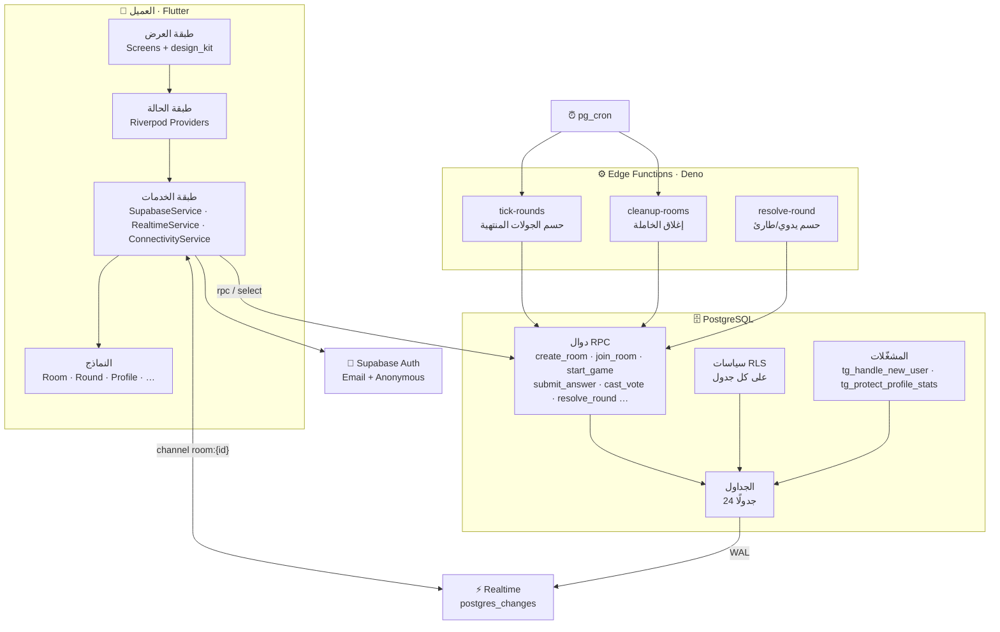
```mermaid
flowchart TB
    subgraph client["📱 العميل · Flutter"]
        direction TB
        UI["طبقة العرض<br/>Screens + design_kit"]
        STATE["طبقة الحالة<br/>Riverpod Providers"]
        SVC["طبقة الخدمات<br/>SupabaseService · RealtimeService · ConnectivityService"]
        MODEL["النماذج<br/>Room · Round · Profile · …"]
        UI --> STATE --> SVC --> MODEL
    end

    subgraph edge["⚙️ Edge Functions · Deno"]
        TICK["tick-rounds<br/>حسم الجولات المنتهية"]
        CLEAN["cleanup-rooms<br/>إغلاق الخاملة"]
        RESOLVE["resolve-round<br/>حسم يدوي/طارئ"]
    end

    subgraph pg["🗄️ PostgreSQL"]
        RPC["دوال RPC<br/>create_room · join_room · start_game<br/>submit_answer · cast_vote · resolve_round …"]
        TBL["الجداول<br/>24 جدولًا"]
        RLS["سياسات RLS<br/>على كل جدول"]
        TRG["المشغّلات<br/>tg_handle_new_user · tg_protect_profile_stats"]
        RPC --> TBL
        RLS --> TBL
        TRG --> TBL
    end

    AUTH["🔑 Supabase Auth<br/>Email + Anonymous"]
    RT["⚡ Realtime<br/>postgres_changes"]

    SVC -->|"rpc / select"| RPC
    SVC --> AUTH
    SVC <-->|"channel room:{id}"| RT
    TBL -->|"WAL"| RT
    TICK & CLEAN & RESOLVE --> RPC
    CRON["⏰ pg_cron"] --> TICK & CLEAN
```

---

## 5. معمارية تطبيق Flutter (Package Diagram)

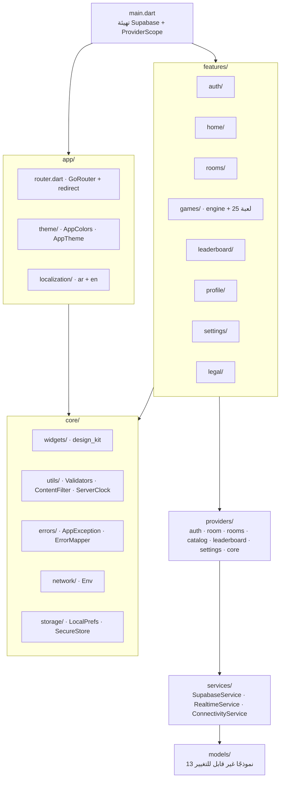
```mermaid
flowchart TB
    MAIN["main.dart<br/>تهيئة Supabase + ProviderScope"]

    subgraph app["app/"]
        ROUTER["router.dart · GoRouter + redirect"]
        THEME["theme/ · AppColors · AppTheme"]
        L10N["localization/ · ar + en"]
    end

    subgraph core["core/"]
        WIDGETS["widgets/ · design_kit"]
        UTILS["utils/ · Validators · ContentFilter · ServerClock"]
        ERRORS["errors/ · AppException · ErrorMapper"]
        NET["network/ · Env"]
        STORAGE["storage/ · LocalPrefs · SecureStore"]
    end

    subgraph features["features/"]
        AUTHF["auth/"]
        HOMEF["home/"]
        ROOMSF["rooms/"]
        GAMESF["games/ · engine + 25 لعبة"]
        LEADF["leaderboard/"]
        PROFF["profile/"]
        SETF["settings/"]
        LEGALF["legal/"]
    end

    PROVIDERS["providers/<br/>auth · room · rooms · catalog · leaderboard · settings · core"]
    SERVICES["services/<br/>SupabaseService · RealtimeService · ConnectivityService"]
    MODELS["models/<br/>13 نموذجًا غير قابل للتغيير"]

    MAIN --> app
    MAIN --> features
    features --> PROVIDERS --> SERVICES --> MODELS
    features --> core
    app --> core
```

**قواعد الاعتماد (Dependency Rules):**

1. `features/` يعتمد على `providers/` و `core/` — ولا يستدعي Supabase مباشرة أبدًا.
2. `providers/` يعتمد على `services/` و `models/`.
3. `services/` الوحيدة التي تعرف وجود Supabase.
4. `models/` لا تعتمد على شيء — كائنات بيانات نقية غير قابلة للتغيير.
5. `core/widgets/design_kit.dart` نقطة استيراد واحدة لكل مكوّنات الواجهة.

---

## 6. مخطط الصفوف (Class Diagram)

### 6.1 نماذج المجال

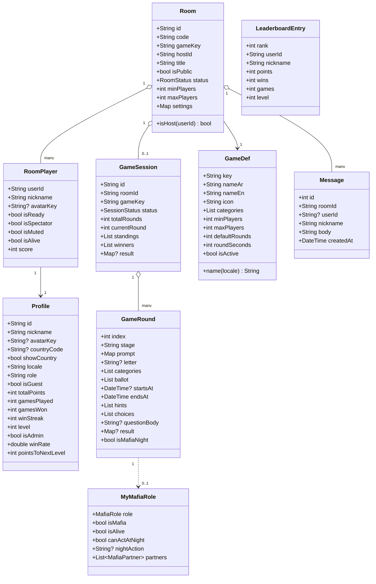
```mermaid
classDiagram
    class Profile {
        +String id
        +String nickname
        +String? avatarKey
        +String? countryCode
        +bool showCountry
        +String locale
        +String role
        +bool isGuest
        +int totalPoints
        +int gamesPlayed
        +int gamesWon
        +int winStreak
        +int level
        +bool isAdmin
        +double winRate
        +int pointsToNextLevel
    }

    class Room {
        +String id
        +String code
        +String gameKey
        +String hostId
        +String title
        +bool isPublic
        +RoomStatus status
        +int minPlayers
        +int maxPlayers
        +Map settings
        +isHost(userId) bool
    }

    class RoomPlayer {
        +String userId
        +String nickname
        +String? avatarKey
        +bool isReady
        +bool isSpectator
        +bool isMuted
        +bool isAlive
        +int score
    }

    class GameSession {
        +String id
        +String roomId
        +String gameKey
        +SessionStatus status
        +int totalRounds
        +int currentRound
        +List standings
        +List winners
        +Map? result
    }

    class GameRound {
        +int index
        +String stage
        +Map prompt
        +String? letter
        +List categories
        +List ballot
        +DateTime? startsAt
        +DateTime endsAt
        +List hints
        +List choices
        +String? questionBody
        +Map? result
        +bool isMafiaNight
    }

    class GameDef {
        +String key
        +String nameAr
        +String nameEn
        +String icon
        +List categories
        +int minPlayers
        +int maxPlayers
        +int defaultRounds
        +int roundSeconds
        +bool isActive
        +name(locale) String
    }

    class MyMafiaRole {
        +MafiaRole role
        +bool isMafia
        +bool isAlive
        +bool canActAtNight
        +String? nightAction
        +List~MafiaPartner~ partners
    }

    class Message {
        +int id
        +String roomId
        +String? userId
        +String nickname
        +String body
        +DateTime createdAt
    }

    class LeaderboardEntry {
        +int rank
        +String userId
        +String nickname
        +int points
        +int wins
        +int games
        +int level
    }

    Room "1" o-- "many" RoomPlayer
    Room "1" --> "1" GameDef
    Room "1" o-- "0..1" GameSession
    GameSession "1" o-- "many" GameRound
    RoomPlayer "1" --> "1" Profile
    Room "1" o-- "many" Message
    GameRound "1" ..> "0..1" MyMafiaRole
```

### 6.2 طبقة الخدمات والحالة

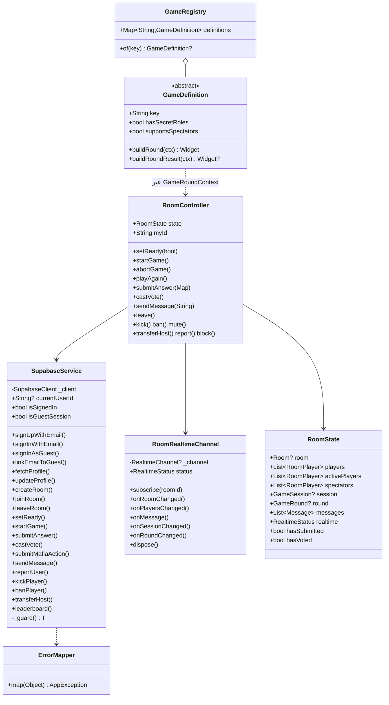
```mermaid
classDiagram
    class SupabaseService {
        -SupabaseClient _client
        +String? currentUserId
        +bool isSignedIn
        +bool isGuestSession
        +signUpWithEmail()
        +signInWithEmail()
        +signInAsGuest()
        +linkEmailToGuest()
        +fetchProfile()
        +updateProfile()
        +createRoom()
        +joinRoom()
        +leaveRoom()
        +setReady()
        +startGame()
        +submitAnswer()
        +castVote()
        +submitMafiaAction()
        +sendMessage()
        +reportUser()
        +kickPlayer()
        +banPlayer()
        +transferHost()
        +leaderboard()
        -_guard() T
    }

    class RoomRealtimeChannel {
        -RealtimeChannel? _channel
        +RealtimeStatus status
        +subscribe(roomId)
        +onRoomChanged()
        +onPlayersChanged()
        +onMessage()
        +onSessionChanged()
        +onRoundChanged()
        +dispose()
    }

    class RoomController {
        +RoomState state
        +String myId
        +setReady(bool)
        +startGame()
        +abortGame()
        +playAgain()
        +submitAnswer(Map)
        +castVote()
        +sendMessage(String)
        +leave()
        +kick() ban() mute()
        +transferHost() report() block()
    }

    class RoomState {
        +Room? room
        +List~RoomPlayer~ players
        +List~RoomPlayer~ activePlayers
        +List~RoomPlayer~ spectators
        +GameSession? session
        +GameRound? round
        +List~Message~ messages
        +RealtimeStatus realtime
        +bool hasSubmitted
        +bool hasVoted
    }

    class GameDefinition {
        <<abstract>>
        +String key
        +bool hasSecretRoles
        +bool supportsSpectators
        +buildRound(ctx) Widget
        +buildRoundResult(ctx) Widget?
    }

    class GameRegistry {
        +Map~String,GameDefinition~ definitions
        +of(key) GameDefinition?
    }

    class ErrorMapper {
        +map(Object) AppException
    }

    RoomController --> RoomState
    RoomController --> SupabaseService
    RoomController --> RoomRealtimeChannel
    SupabaseService ..> ErrorMapper
    GameRegistry o-- GameDefinition
    GameDefinition ..> RoomController : عبر GameRoundContext
```

### 6.3 نظام التصميم (Design Kit)

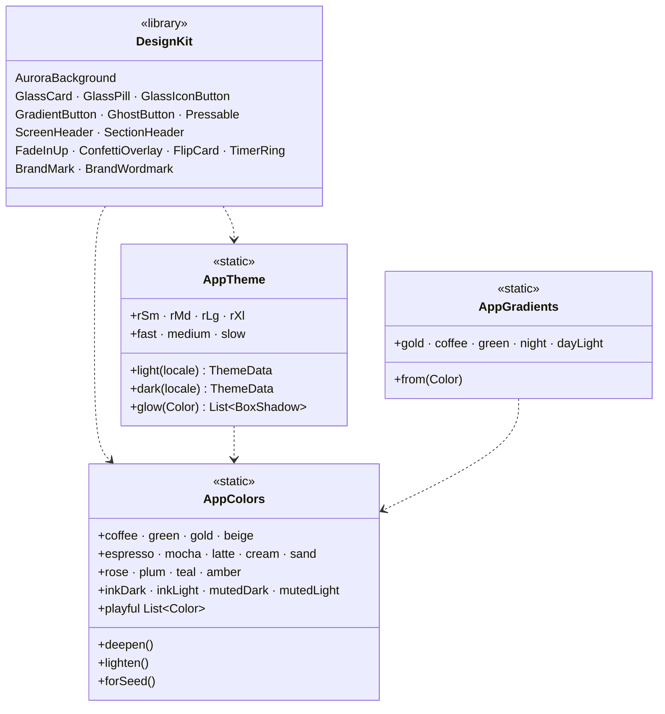
```mermaid
classDiagram
    class AppColors {
        <<static>>
        +coffee · green · gold · beige
        +espresso · mocha · latte · cream · sand
        +rose · plum · teal · amber
        +inkDark · inkLight · mutedDark · mutedLight
        +playful List~Color~
        +deepen()
        +lighten()
        +forSeed()
    }
    class AppGradients {
        <<static>>
        +gold · coffee · green · night · dayLight
        +from(Color)
    }
    class AppTheme {
        <<static>>
        +light(locale) ThemeData
        +dark(locale) ThemeData
        +rSm · rMd · rLg · rXl
        +fast · medium · slow
        +glow(Color) List~BoxShadow~
    }
    class DesignKit {
        <<library>>
        AuroraBackground
        GlassCard · GlassPill · GlassIconButton
        GradientButton · GhostButton · Pressable
        ScreenHeader · SectionHeader
        FadeInUp · ConfettiOverlay · FlipCard · TimerRing
        BrandMark · BrandWordmark
    }
    DesignKit ..> AppColors
    DesignKit ..> AppTheme
    AppTheme ..> AppColors
    AppGradients ..> AppColors
```

---

## 7. مخطط قاعدة البيانات (ERD)

قاعدة البيانات 24 جدولًا موزّعة على ست مجموعات.

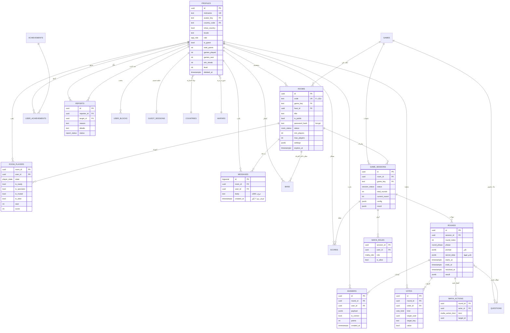
```mermaid
erDiagram
    PROFILES ||--o{ ROOMS : "يستضيف"
    PROFILES ||--o{ ROOM_PLAYERS : "يلعب"
    PROFILES ||--o{ MESSAGES : "يكتب"
    PROFILES ||--o{ ANSWERS : "يجيب"
    PROFILES ||--o{ VOTES : "يصوّت"
    PROFILES ||--o{ SCORES : "يسجّل"
    PROFILES ||--o{ USER_ACHIEVEMENTS : "يحقق"
    PROFILES ||--o{ REPORTS : "يبلّغ"
    PROFILES ||--o{ BANS : "يُحظر"
    PROFILES ||--o{ USER_BLOCKS : "يحجب"
    PROFILES ||--o| GUEST_SESSIONS : "جلسة ضيف"
    PROFILES }o--|| COUNTRIES : "دولة اختيارية"
    PROFILES }o--|| AVATARS : "صورة رمزية"

    GAMES ||--o{ ROOMS : "تُلعب في"
    GAMES ||--o{ GAME_SESSIONS : "جلسات"
    GAMES ||--o{ QUESTIONS : "بنك محتوى"

    ROOMS ||--o{ ROOM_PLAYERS : "أعضاء"
    ROOMS ||--o{ MESSAGES : "دردشة"
    ROOMS ||--o{ GAME_SESSIONS : "مباريات"
    ROOMS ||--o{ BANS : "حظر داخل الغرفة"

    GAME_SESSIONS ||--o{ ROUNDS : "جولات"
    GAME_SESSIONS ||--o{ SCORES : "نقاط"
    GAME_SESSIONS ||--o{ MAFIA_ROLES : "أدوار"

    ROUNDS ||--o{ ANSWERS : "إجابات"
    ROUNDS ||--o{ VOTES : "أصوات"
    ROUNDS ||--o{ MAFIA_ACTIONS : "أفعال ليلية"
    ROUNDS }o--|| QUESTIONS : "سؤال مصدر"

    ACHIEVEMENTS ||--o{ USER_ACHIEVEMENTS : "تُمنح"
    REPORTS }o--|| PROFILES : "ضد لاعب"

    PROFILES {
        uuid id PK
        text nickname UK
        text avatar_key FK
        text country_code FK
        bool show_country
        text locale
        app_role role
        bool is_guest
        int total_points
        int games_played
        int games_won
        int win_streak
        int level
        timestamptz deleted_at
    }
    ROOMS {
        uuid id PK
        text code UK "6 خانات"
        text game_key FK
        uuid host_id FK
        text title
        bool is_public
        text password_hash "bcrypt"
        room_status status
        int min_players
        int max_players
        jsonb settings
        timestamptz expires_at
    }
    ROOM_PLAYERS {
        uuid room_id PK
        uuid user_id PK
        player_state state
        bool is_ready
        bool is_spectator
        bool is_muted
        bool is_alive
        int seat
        int score
    }
    GAME_SESSIONS {
        uuid id PK
        uuid room_id FK
        text game_key FK
        session_status status
        int total_rounds
        int current_round
        jsonb config
        jsonb result
    }
    ROUNDS {
        uuid id PK
        uuid session_id FK
        int round_index
        round_phase phase
        jsonb prompt "عام"
        jsonb secret_data "خادم فقط"
        timestamptz starts_at
        timestamptz ends_at
        timestamptz resolved_at
        jsonb result
    }
    ANSWERS {
        uuid id PK
        uuid round_id FK
        uuid user_id FK
        jsonb payload
        bool is_correct
        int points
        timestamptz created_at
    }
    VOTES {
        uuid id PK
        uuid round_id FK
        uuid voter_id FK
        vote_kind kind
        uuid target_user
        text target_key
        bool value
    }
    MAFIA_ROLES {
        uuid session_id FK
        uuid user_id FK
        mafia_role role
        bool is_alive
    }
    MAFIA_ACTIONS {
        uuid round_id FK
        uuid actor_id FK
        mafia_action_kind kind
        uuid target_id
    }
    MESSAGES {
        bigserial id PK
        uuid room_id FK
        uuid user_id FK
        text body "≤300 حرف"
        timestamptz created_at "تُحذف بعد 7 أيام"
    }
    REPORTS {
        uuid id PK
        uuid reporter_id FK
        uuid target_id FK
        text reason
        text details
        report_status status
    }
```

### الأنواع المعدودة (Enums)

| النوع | القيم |
|-------|-------|
| `room_status` | `waiting` · `starting` · `playing` · `paused` · `finished` · `cancelled` |
| `player_state` | `connected` · `disconnected` · `ready` · `not_ready` · `alive` · `dead` · `spectator` · `banned` |
| `session_status` | `pending` · `running` · `finished` · `aborted` |
| `round_phase` | `pending` · `prompt` · `collecting` · `night` · `night_actions` · `day` · `discussion` · `voting` · `scoring` · `revealed` · `finished` |
| `mafia_role` | `mafia` · `citizen` · `doctor` · `detective` · `guard` |
| `mafia_action_kind` | `kill` · `heal` · `investigate` · `protect` |
| `vote_kind` | `lynch` · `best_answer` · `validate_answer` · `liar` · `story_line` |
| `report_status` | `open` · `reviewing` · `resolved` · `rejected` |
| `ban_scope` | `room` · `global` |
| `app_role` | `player` · `moderator` · `admin` |
| `game_category` | `yemeni` · `arabic` · `global` · `family` · `fast` · `competitive` |

---

## 8. آلة حالة الغرفة

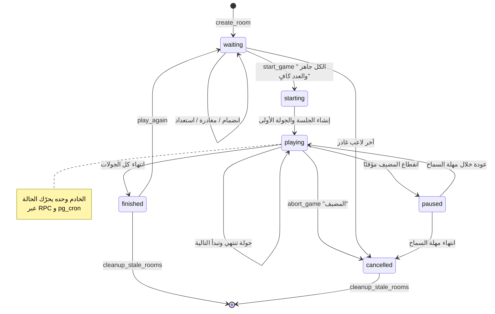
```mermaid
stateDiagram-v2
    [*] --> waiting : create_room
    waiting --> waiting : انضمام / مغادرة / استعداد
    waiting --> starting : start_game "الكل جاهز والعدد كافٍ"
    starting --> playing : إنشاء الجلسة والجولة الأولى
    playing --> playing : جولة تنتهي وتبدأ التالية
    playing --> paused : انقطاع المضيف مؤقتًا
    paused --> playing : عودة خلال مهلة السماح
    playing --> finished : انتهاء كل الجولات
    playing --> cancelled : abort_game "المضيف"
    finished --> waiting : play_again
    waiting --> cancelled : آخر لاعب غادر
    paused --> cancelled : انتهاء مهلة السماح
    finished --> [*] : cleanup_stale_rooms
    cancelled --> [*] : cleanup_stale_rooms

    note right of playing
        الخادم وحده يحرّك الحالة
        عبر RPC و pg_cron
    end note
```

---

## 9. آلة حالة الجولة

الأطوار تختلف حسب نوع اللعبة، وكلها تنتهي إلى `revealed`.

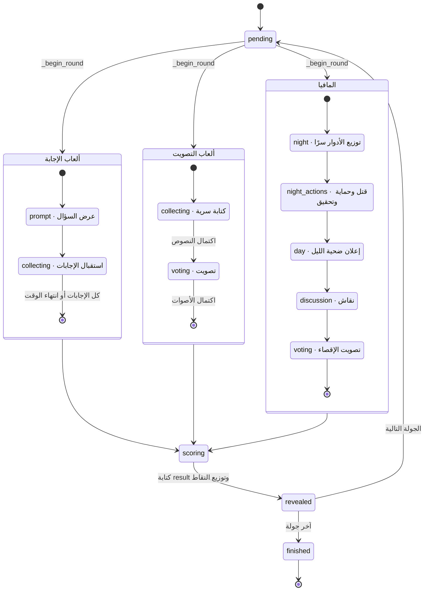
```mermaid
stateDiagram-v2
    [*] --> pending

    state "ألعاب الإجابة" as answer_games {
        a_prompt : prompt · عرض السؤال
        a_collect : collecting · استقبال الإجابات
        [*] --> a_prompt
        a_prompt --> a_collect
        a_collect --> [*] : كل الإجابات أو انتهاء الوقت
    }

    state "ألعاب التصويت" as vote_games {
        v_collect : collecting · كتابة سرية
        v_vote : voting · تصويت
        [*] --> v_collect
        v_collect --> v_vote : اكتمال النصوص
        v_vote --> [*] : اكتمال الأصوات
    }

    state "المافيا" as mafia_game {
        m_night : night · توزيع الأدوار سرًا
        m_actions : night_actions · قتل وحماية وتحقيق
        m_day : day · إعلان ضحية الليل
        m_disc : discussion · نقاش
        m_vote : voting · تصويت الإقصاء
        [*] --> m_night
        m_night --> m_actions
        m_actions --> m_day
        m_day --> m_disc
        m_disc --> m_vote
        m_vote --> [*]
    }

    pending --> answer_games : _begin_round
    pending --> vote_games : _begin_round
    pending --> mafia_game : _begin_round

    answer_games --> scoring
    vote_games --> scoring
    mafia_game --> scoring

    scoring --> revealed : كتابة result وتوزيع النقاط
    revealed --> pending : الجولة التالية
    revealed --> finished : آخر جولة
    finished --> [*]
```

**الساعة الموثوقة:** `rounds.ends_at` يأتي من الخادم، والتطبيق يحسب المتبقي
بـ `ServerClock` الذي يصحّح فرق ساعة الجهاز عبر `server_now()` كل 5 دقائق.

---

## 10. آلة حالة حساب المستخدم

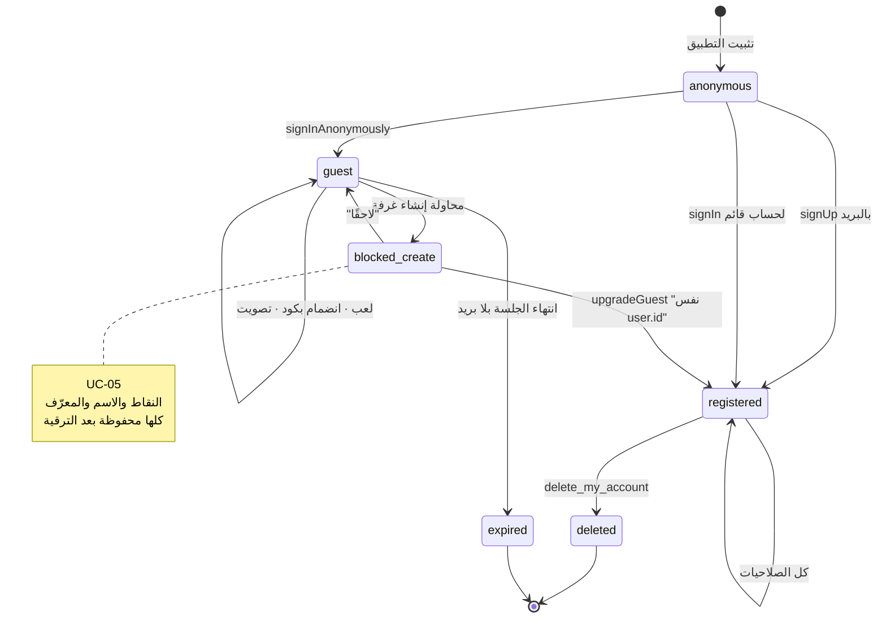
```mermaid
stateDiagram-v2
    [*] --> anonymous : تثبيت التطبيق
    anonymous --> guest : signInAnonymously
    anonymous --> registered : signUp بالبريد
    anonymous --> registered : signIn لحساب قائم

    guest --> guest : لعب · انضمام بكود · تصويت
    guest --> blocked_create : محاولة إنشاء غرفة
    blocked_create --> guest : "لاحقًا"
    blocked_create --> registered : upgradeGuest "نفس user.id"

    registered --> registered : كل الصلاحيات
    registered --> deleted : delete_my_account
    guest --> expired : انتهاء الجلسة بلا بريد
    deleted --> [*]
    expired --> [*]

    note right of blocked_create
        UC-05
        النقاط والاسم والمعرّف
        كلها محفوظة بعد الترقية
    end note
```

---

## 11. آلة حالة الاتصال اللحظي

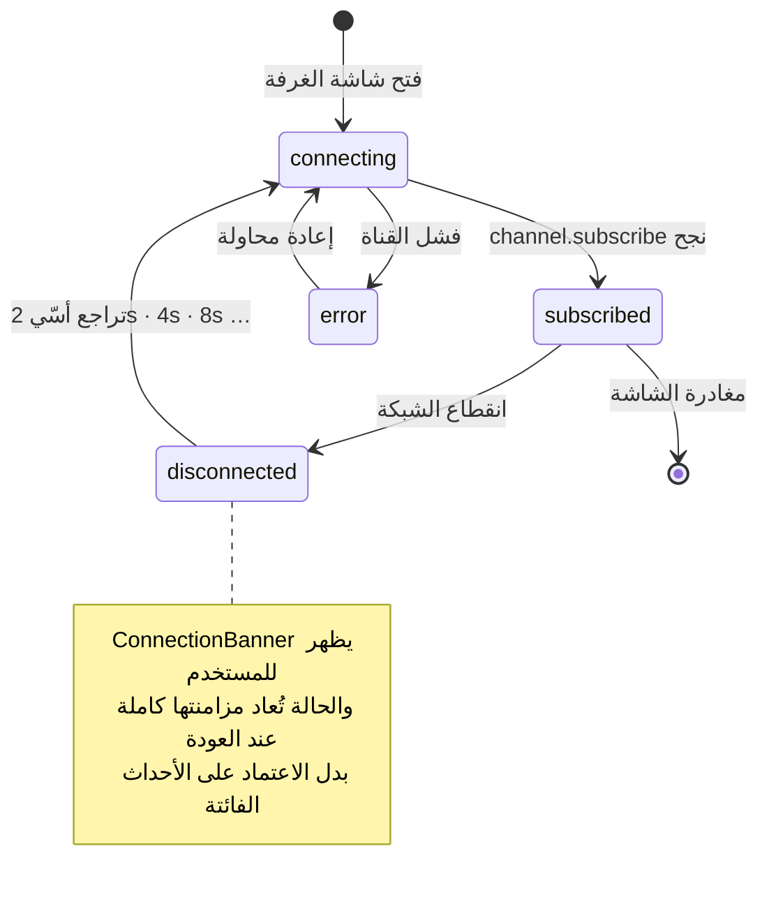
```mermaid
stateDiagram-v2
    [*] --> connecting : فتح شاشة الغرفة
    connecting --> subscribed : channel.subscribe نجح
    connecting --> error : فشل القناة
    subscribed --> disconnected : انقطاع الشبكة
    disconnected --> connecting : تراجع أسّي 2s · 4s · 8s …
    error --> connecting : إعادة محاولة
    subscribed --> [*] : مغادرة الشاشة

    note right of disconnected
        ConnectionBanner يظهر للمستخدم
        والحالة تُعاد مزامنتها كاملة عند العودة
        بدل الاعتماد على الأحداث الفائتة
    end note
```

---

## 12. تسلسل: المصادقة والدخول

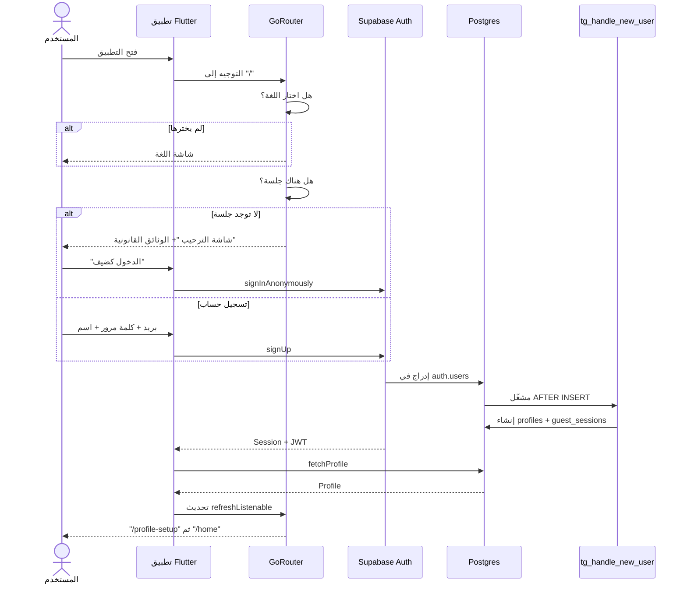
```mermaid
sequenceDiagram
    actor U as المستخدم
    participant APP as تطبيق Flutter
    participant R as GoRouter
    participant A as Supabase Auth
    participant DB as Postgres
    participant TG as tg_handle_new_user

    U->>APP: فتح التطبيق
    APP->>R: التوجيه إلى "/"
    R->>R: هل اختار اللغة؟
    alt لم يخترها
        R-->>U: شاشة اللغة
    end
    R->>R: هل هناك جلسة؟
    alt لا توجد جلسة
        R-->>U: شاشة الترحيب "+ الوثائق القانونية"
        U->>APP: "الدخول كضيف"
        APP->>A: signInAnonymously
    else تسجيل حساب
        U->>APP: بريد + كلمة مرور + اسم
        APP->>A: signUp
    end
    A->>DB: إدراج في auth.users
    DB->>TG: مشغّل AFTER INSERT
    TG->>DB: إنشاء profiles + guest_sessions
    A-->>APP: Session + JWT
    APP->>DB: fetchProfile
    DB-->>APP: Profile
    APP->>R: تحديث refreshListenable
    R-->>U: "/profile-setup" ثم "/home"
```

---

## 13. تسلسل: ترقية حساب الضيف

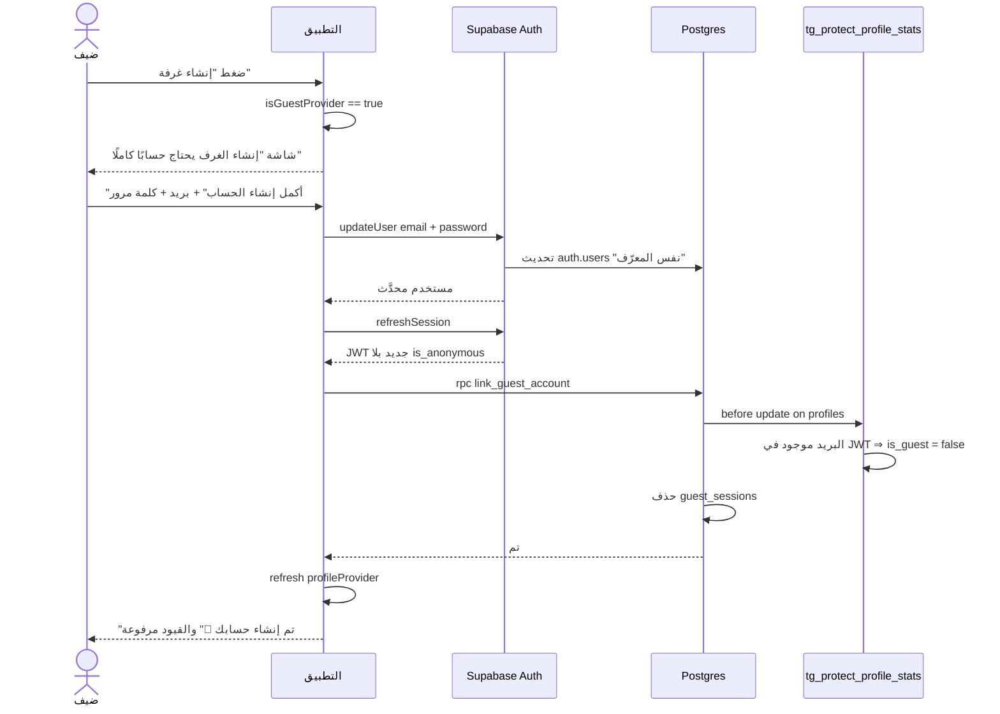
```mermaid
sequenceDiagram
    actor G as ضيف
    participant APP as التطبيق
    participant A as Supabase Auth
    participant DB as Postgres
    participant TRG as tg_protect_profile_stats

    G->>APP: ضغط "إنشاء غرفة"
    APP->>APP: isGuestProvider == true
    APP-->>G: شاشة "إنشاء الغرف يحتاج حسابًا كاملًا"
    G->>APP: "أكمل إنشاء الحساب" + بريد + كلمة مرور
    APP->>A: updateUser email + password
    A->>DB: تحديث auth.users "نفس المعرّف"
    A-->>APP: مستخدم محدَّث
    APP->>A: refreshSession
    A-->>APP: JWT جديد بلا is_anonymous
    APP->>DB: rpc link_guest_account
    DB->>TRG: before update on profiles
    TRG->>TRG: البريد موجود في JWT ⇒ is_guest = false
    DB->>DB: حذف guest_sessions
    DB-->>APP: تم
    APP->>APP: refresh profileProvider
    APP-->>G: "تم إنشاء حسابك 🎉" والقيود مرفوعة
```

---

## 14. تسلسل: إنشاء غرفة ودعوة الأصدقاء

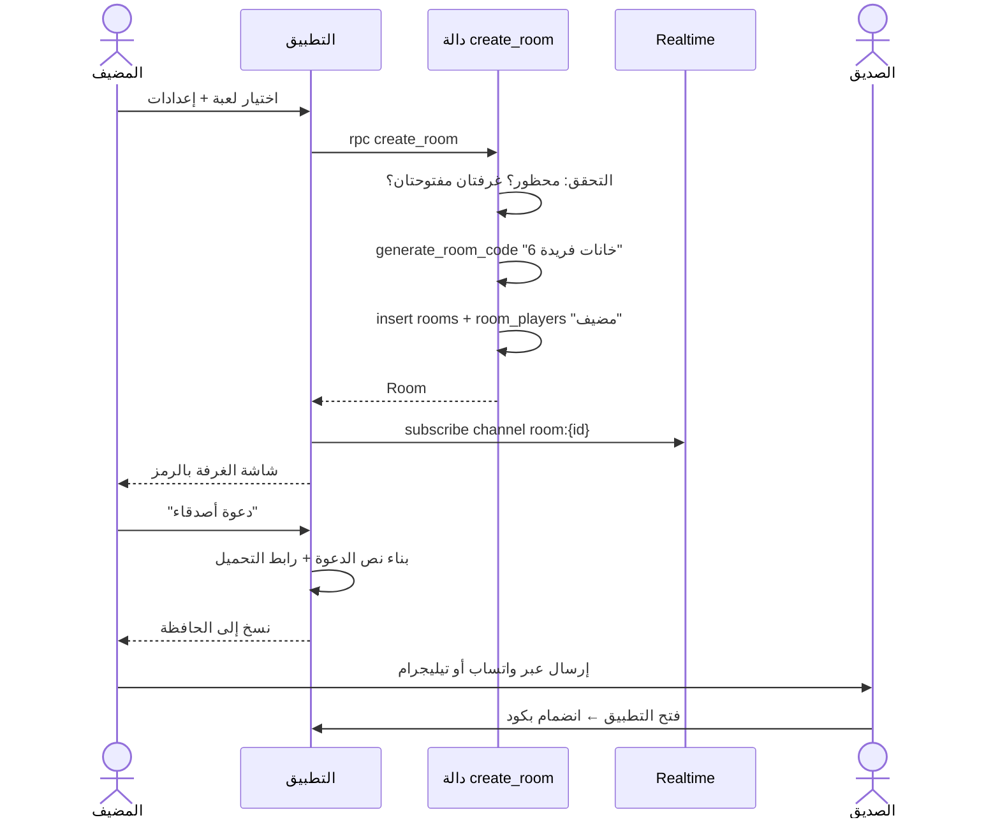
```mermaid
sequenceDiagram
    actor H as المضيف
    participant APP as التطبيق
    participant DB as دالة create_room
    participant RT as Realtime
    actor F as الصديق

    H->>APP: اختيار لعبة + إعدادات
    APP->>DB: rpc create_room
    DB->>DB: التحقق: محظور؟ غرفتان مفتوحتان؟
    DB->>DB: generate_room_code "6 خانات فريدة"
    DB->>DB: insert rooms + room_players "مضيف"
    DB-->>APP: Room
    APP->>RT: subscribe channel room:{id}
    APP-->>H: شاشة الغرفة بالرمز
    H->>APP: "دعوة أصدقاء"
    APP->>APP: بناء نص الدعوة + رابط التحميل
    APP-->>H: نسخ إلى الحافظة
    H->>F: إرسال عبر واتساب أو تيليجرام
    F->>APP: فتح التطبيق ← انضمام بكود
```

---

## 15. تسلسل: الانضمام إلى غرفة

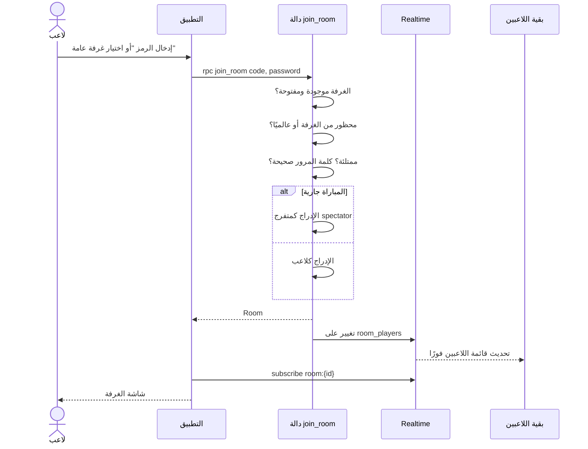
```mermaid
sequenceDiagram
    actor P as لاعب
    participant APP as التطبيق
    participant DB as دالة join_room
    participant RT as Realtime
    participant O as بقية اللاعبين

    P->>APP: إدخال الرمز "أو اختيار غرفة عامة"
    APP->>DB: rpc join_room code, password
    DB->>DB: الغرفة موجودة ومفتوحة؟
    DB->>DB: محظور من الغرفة أو عالميًا؟
    DB->>DB: ممتلئة؟ كلمة المرور صحيحة؟
    alt المباراة جارية
        DB->>DB: الإدراج كمتفرج spectator
    else
        DB->>DB: الإدراج كلاعب
    end
    DB-->>APP: Room
    DB->>RT: تغيير على room_players
    RT-->>O: تحديث قائمة اللاعبين فورًا
    APP->>RT: subscribe room:{id}
    APP-->>P: شاشة الغرفة
```

---

## 16. تسلسل: دورة الجولة الكاملة

هذا هو **قلب اللعبة** — وأهم مخطط في الوثيقة.

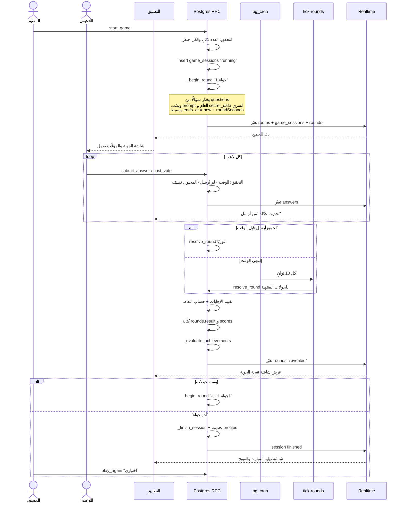
```mermaid
sequenceDiagram
    actor H as المضيف
    actor P as اللاعبون
    participant APP as التطبيق
    participant DB as Postgres RPC
    participant CRON as pg_cron
    participant EF as tick-rounds
    participant RT as Realtime

    H->>DB: start_game
    DB->>DB: التحقق: العدد كافٍ والكل جاهز
    DB->>DB: insert game_sessions "running"
    DB->>DB: _begin_round "جولة 1"
    Note over DB: يختار سؤالًا من questions<br/>ويكتب prompt العام و secret_data السري<br/>ويضبط ends_at = now + roundSeconds
    DB->>RT: تغيّر rooms + game_sessions + rounds
    RT-->>APP: بث للجميع
    APP-->>P: شاشة الجولة والمؤقّت يعمل

    loop كل لاعب
        P->>DB: submit_answer / cast_vote
        DB->>DB: التحقق: الوقت · لم يُرسل · المحتوى نظيف
        DB->>RT: تغيّر answers
        RT-->>APP: تحديث عدّاد "من أرسل"
    end

    alt الجميع أرسل قبل الوقت
        DB->>DB: resolve_round فوريًا
    else انتهى الوقت
        CRON->>EF: كل 10 ثوانٍ
        EF->>DB: resolve_round للجولات المنتهية
    end

    DB->>DB: تقييم الإجابات + حساب النقاط
    DB->>DB: كتابة rounds.result و scores
    DB->>DB: _evaluate_achievements
    DB->>RT: تغيّر rounds "revealed"
    RT-->>APP: عرض شاشة نتيجة الجولة

    alt بقيت جولات
        DB->>DB: _begin_round "الجولة التالية"
    else آخر جولة
        DB->>DB: _finish_session + تحديث profiles
        DB->>RT: session finished
        RT-->>APP: شاشة نهاية المباراة والتتويج
        H->>DB: play_again "اختياري"
    end
```

---

## 17. تسلسل: ليل ونهار المافيا

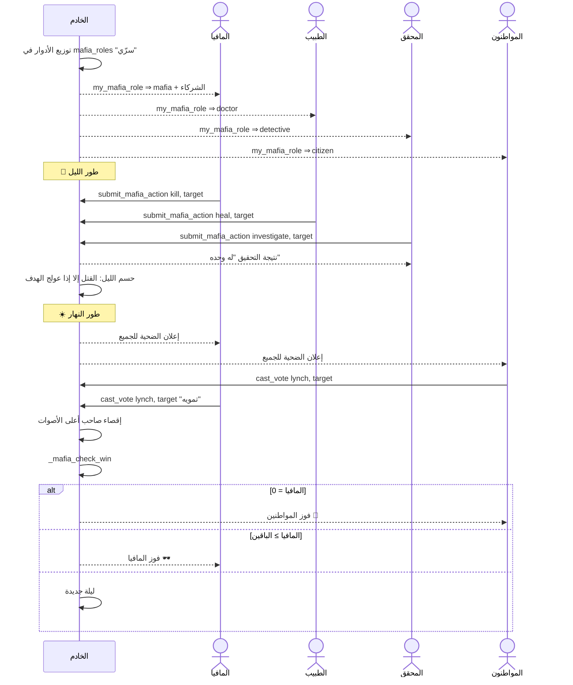
```mermaid
sequenceDiagram
    participant DB as الخادم
    actor M as المافيا
    actor D as الطبيب
    actor DT as المحقق
    actor C as المواطنون

    DB->>DB: توزيع الأدوار في mafia_roles "سرّي"
    DB-->>M: my_mafia_role ⇒ mafia + الشركاء
    DB-->>D: my_mafia_role ⇒ doctor
    DB-->>DT: my_mafia_role ⇒ detective
    DB-->>C: my_mafia_role ⇒ citizen

    Note over DB: 🌙 طور الليل
    M->>DB: submit_mafia_action kill, target
    D->>DB: submit_mafia_action heal, target
    DT->>DB: submit_mafia_action investigate, target
    DB-->>DT: نتيجة التحقيق "له وحده"

    DB->>DB: حسم الليل: القتل إلا إذا عولج الهدف
    Note over DB: ☀️ طور النهار
    DB-->>M: إعلان الضحية للجميع
    DB-->>C: إعلان الضحية للجميع
    C->>DB: cast_vote lynch, target
    M->>DB: cast_vote lynch, target "تمويه"
    DB->>DB: إقصاء صاحب أعلى الأصوات
    DB->>DB: _mafia_check_win
    alt المافيا = 0
        DB-->>C: فوز المواطنين 🎉
    else المافيا ≥ الباقين
        DB-->>M: فوز المافيا 🕶️
    else
        DB->>DB: ليلة جديدة
    end
```

---

## 18. تسلسل: الدردشة والإبلاغ

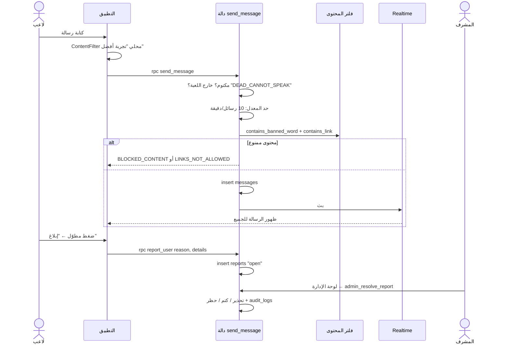
```mermaid
sequenceDiagram
    actor P as لاعب
    participant APP as التطبيق
    participant DB as دالة send_message
    participant F as فلتر المحتوى
    participant RT as Realtime
    actor A as المشرف

    P->>APP: كتابة رسالة
    APP->>APP: ContentFilter محلي "تجربة أفضل"
    APP->>DB: rpc send_message
    DB->>DB: مكتوم؟ خارج اللعبة؟ "DEAD_CANNOT_SPEAK"
    DB->>DB: حد المعدل: 10 رسائل/دقيقة
    DB->>F: contains_banned_word + contains_link
    alt محتوى ممنوع
        DB-->>APP: BLOCKED_CONTENT أو LINKS_NOT_ALLOWED
    else
        DB->>DB: insert messages
        DB->>RT: بث
        RT-->>APP: ظهور الرسالة للجميع
    end

    P->>APP: ضغط مطوّل ← "إبلاغ"
    APP->>DB: rpc report_user reason, details
    DB->>DB: insert reports "open"
    A->>DB: لوحة الإدارة ← admin_resolve_report
    DB->>DB: تحذير / كتم / حظر + audit_logs
```

---

## 19. مخطط النشاط: دورة اللعب

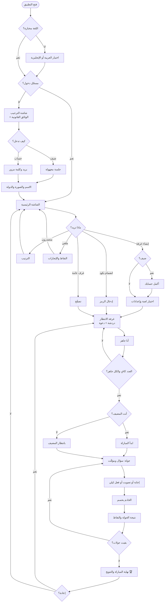
```mermaid
flowchart TD
    START([فتح التطبيق]) --> LANG{اللغة مختارة؟}
    LANG -- لا --> PICK[اختيار العربية أو الإنجليزية] --> AUTH
    LANG -- نعم --> AUTH{مسجّل دخول؟}
    AUTH -- لا --> WELCOME[شاشة الترحيب<br/>+ الوثائق القانونية] --> CHOICE{كيف تدخل؟}
    CHOICE -- ضيف --> GUEST[جلسة مجهولة]
    CHOICE -- حساب --> REG[بريد وكلمة مرور]
    GUEST --> SETUP
    REG --> SETUP[الاسم والصورة والدولة]
    AUTH -- نعم --> HOME
    SETUP --> HOME[الشاشة الرئيسية]

    HOME --> WHAT{ماذا تريد؟}
    WHAT -- إنشاء غرفة --> ISGUEST{ضيف؟}
    ISGUEST -- نعم --> UPGRADE[أكمل حسابك] --> CREATE
    ISGUEST -- لا --> CREATE[اختيار لعبة وإعدادات]
    CREATE --> ROOM
    WHAT -- انضمام بكود --> CODE[إدخال الرمز] --> ROOM
    WHAT -- غرف عامة --> BROWSE[تصفّح] --> ROOM
    WHAT -- متصدرون --> LB[الترتيب] --> HOME
    WHAT -- ملفي --> PROF[النقاط والإنجازات] --> HOME

    ROOM[غرفة الانتظار<br/>دردشة + دعوة] --> READY[أنا جاهز]
    READY --> ENOUGH{العدد كافٍ والكل جاهز؟}
    ENOUGH -- لا --> ROOM
    ENOUGH -- نعم --> HOST{أنت المضيف؟}
    HOST -- نعم --> START_G[ابدأ المباراة] --> ROUND
    HOST -- لا --> WAIT[بانتظار المضيف] --> ROUND

    ROUND[جولة: سؤال ومؤقّت] --> ACT[إجابة أو تصويت أو فعل ليلي]
    ACT --> RESOLVE[الخادم يحسم]
    RESOLVE --> RRES[نتيجة الجولة والنقاط]
    RRES --> MORE{بقيت جولات؟}
    MORE -- نعم --> ROUND
    MORE -- لا --> END[نهاية المباراة والتتويج 🏆]
    END --> AGAIN{إعادة؟}
    AGAIN -- نعم --> ROOM
    AGAIN -- لا --> HOME
```

---

## 20. خريطة التنقل (Navigation Map)

```mermaid
flowchart TB
    SPLASH["/ · SplashScreen"]
    LANGS["/language"]
    WELCOME["/welcome"]
    SIGNIN["/sign-in"]
    SIGNUP["/sign-up"]
    SETUP["/profile-setup"]

    subgraph shell["StatefulShellRoute · شريط سفلي زجاجي"]
        HOME["/home"]
        GAMES["/games"]
        LB["/leaderboard"]
        PROFILE["/profile"]
    end

    CREATE["/create-room?game="]
    JOIN["/join?code="]
    PUBLIC["/public-rooms"]
    ROOM["/room/:id"]
    SETTINGS["/settings"]
    PRIVACY["/privacy"]
    TERMS["/terms"]
    RULES["/rules"]
    NONET["/no-internet"]
    NF["404 · NotFound"]

    SPLASH --> LANGS --> WELCOME
    WELCOME --> SIGNIN & SIGNUP
    WELCOME -.->|"ضيف"| SETUP
    SIGNIN & SIGNUP --> SETUP --> HOME
    WELCOME --> PRIVACY & TERMS & RULES

    HOME --> CREATE & JOIN & PUBLIC
    GAMES --> CREATE & PUBLIC
    CREATE & JOIN & PUBLIC --> ROOM
    PROFILE --> SETTINGS
    SETTINGS --> PRIVACY & TERMS & RULES
    ROOM -->|"انتهاء / مغادرة"| HOME

    classDef public fill:#D9A441,stroke:#B27E23,color:#2A1C12
    class WELCOME,SIGNIN,SIGNUP,PRIVACY,TERMS,RULES,LANGS,NONET public
```

**المسارات العامة (بلا تسجيل دخول):** `/` · `/language` · `/welcome` · `/sign-in` ·
`/sign-up` · `/privacy` · `/terms` · `/rules` · `/no-internet`.
أي مسار آخر يعيد توجيهك إلى `/welcome` — وهذا يضمن أن الوثائق القانونية **تُقرأ قبل التسجيل**.

---

## 21. تدفق البيانات اللحظي (Realtime)

```mermaid
flowchart LR
    subgraph db["Postgres"]
        T1[("rooms")]
        T2[("room_players")]
        T3[("messages")]
        T4[("game_sessions")]
        T5[("rounds")]
    end

    WAL["WAL · Logical Replication"]
    CH["قناة room:{roomId}"]

    subgraph app["التطبيق"]
        RC["RoomController"]
        ST["RoomState"]
        UI["شاشة الغرفة"]
    end

    T1 -->|"UPDATE id = roomId"| WAL
    T2 -->|"ALL room_id = roomId"| WAL
    T3 -->|"INSERT room_id = roomId"| WAL
    T4 -->|"ALL room_id = roomId"| WAL
    T5 -->|"ALL · يُفلتر محليًا"| WAL
    WAL --> CH --> RC --> ST --> UI

    RC -->|"heartbeat كل 20 ثانية"| T2
    RC -->|"إعادة مزامنة كاملة بعد الانقطاع"| db
```

> `rounds` لا تحمل `room_id` فتُستقبل تغييراتها كلها ضمن ما تسمح به RLS
> (أي جولات غرفك فقط) ثم تُفلتر محليًا بمعرّف الجلسة.

---

## 22. طبقات الأمان و RLS

```mermaid
flowchart TB
    U["👤 مستخدم بـ JWT"]

    L1["الطبقة 1 · التطبيق<br/>إخفاء الأزرار غير المسموحة<br/>«تجربة فقط — ليست أمانًا»"]
    L2["الطبقة 2 · RLS<br/>سياسة على كل جدول<br/>لا تقرأ ما لست عضوًا فيه"]
    L3["الطبقة 3 · دوال RPC<br/>SECURITY DEFINER<br/>كل تحقق منطقي هنا"]
    L4["الطبقة 4 · مشغّلات<br/>تجميد النقاط والأدوار<br/>tg_protect_profile_stats"]
    L5["الطبقة 5 · فلاتر المحتوى<br/>banned_words · حدود المعدل · منع الروابط"]
    DATA[("🗄️ البيانات")]

    U --> L1 --> L2 --> L3 --> L4 --> L5 --> DATA

    SEC["🔒 secret_data و password_hash<br/>لا تُرسَل للعميل إطلاقًا"]
    L2 -. "تحجب" .-> SEC
```

| ما يحميه | كيف |
|----------|-----|
| كلمة مرور الغرفة | `bcrypt` في `password_hash`، لا تُعاد للعميل |
| أسرار الجولة (كلمة الكذاب، الأدوار) | `rounds.secret_data` محجوب بـ RLS؛ يصل كل لاعب لسرّه عبر `my_round_secret()` |
| النقاط والمستوى والدور | مشغّل يجمّدها: العميل لا يستطيع تعديلها ولو حاول |
| الغرف الخاصة | لا تظهر في `list_public_rooms()` ولا تُقرأ لغير الأعضاء |
| الرسائل | نصية فقط · ≤300 حرف · 10/دقيقة · تُحذف تلقائيًا بعد 7 أيام |
| الحسابات | `delete_my_account()` يُخفي الاسم والرسائل نهائيًا |

---

## 23. مخطط النشر (Deployment)

```mermaid
flowchart TB
    subgraph phones["أجهزة اللاعبين"]
        AND["📱 Android 6+<br/>app-release.apk<br/>موقّع بمفتاحك"]
        IOS["📱 iOS 13+<br/>TestFlight · اختياري"]
    end

    subgraph dev["جهاز المطوّر · Windows"]
        FL["Flutter SDK + JDK 17"]
        KS["🔐 lametna-keystore.jks<br/>+ key.properties"]
        ENVJ["env.json<br/>SUPABASE_URL · ANON_KEY · APP_DOWNLOAD_URL"]
    end

    subgraph cloud["Supabase Cloud · Free Tier"]
        PG[("Postgres 15<br/>24 جدولًا · RLS")]
        AUTHS["Auth"]
        RTS["Realtime"]
        EFS["Edge Functions<br/>Deno"]
        CRONS["pg_cron"]
    end

    HOSTING["🖥️ Vercel / Netlify / Cloudflare Pages<br/>لوحة الإدارة الساكنة"]
    DIST["📤 واتساب · تيليجرام · GitHub Releases"]

    FL -->|"flutter build apk --release"| DIST
    KS --> FL
    ENVJ --> FL
    DIST --> AND
    AND <-->|"HTTPS + WSS"| cloud
    IOS <-->|"HTTPS + WSS"| cloud
    HOSTING --> PG
    CRONS --> EFS --> PG
```

---

## 24. خريطة الألعاب ومحرّكها

كل لعبة = صنف يرث `GameDefinition` ويُسجَّل في `GameRegistry`.
إضافة لعبة جديدة لا تتطلب تعديل شاشة الغرفة إطلاقًا.

```mermaid
flowchart TB
    REG["GameRegistry.definitions<br/>Map&lt;String, GameDefinition&gt;"]

    subgraph single["SingleAnswerView · 13 لعبة"]
        S1["true_false · guess_word · proverbs"]
        S2["capitals · flags · riddles · islamic"]
        S3["sports · history · emoji_puzzle"]
        S4["fast_math · best_answer · who_am_i"]
    end

    subgraph social["social_views · 4 ألعاب"]
        SO1["most_likely · confessions"]
        SO2["never_have_i · would_you_rather · truth"]
    end

    subgraph special["شاشات خاصة"]
        SP1["animal_plant_object<br/>حرف + فئات"]
        SP2["mafia<br/>ليل ونهار وأدوار"]
        SP3["liar · secret_job · spy<br/>كلمة سرّية وتصويت"]
        SP4["group_story<br/>سطر لكل لاعب"]
        SP5["wink<br/>غمّاز سري"]
    end

    SHARED["GameRoundScaffold<br/>ترويسة + مؤقّت + تذييل موحّد"]
    RESULT["RoundResultView ← MatchEndView"]

    REG --> single & social & special
    single & social & special --> SHARED --> RESULT
```

### تصنيف الألعاب حسب النمط

| النمط | الألعاب | التصويت | أسرار |
|-------|---------|---------|-------|
| **إجابة مباشرة** | صح/خطأ · خمّن الكلمة · الأمثال · العواصم · الأعلام · الألغاز · الديني · الرياضة · التاريخ · الإيموجي · الحساب السريع | ❌ | ❌ |
| **إجابة + تصويت** | أفضل جواب · القصة الجماعية · من صاحب الاعتراف؟ | ✅ | ❌ |
| **تصويت على لاعب** | مين فينا؟ · أنا ما سويت قط · لو خيّروك · صراحة | ✅ | ❌ |
| **دور سرّي** | المافيا · الكذاب · المهنة السرية · الجاسوس · الغمزة · من أنا؟ | ✅ | ✅ |
| **فئات ومهلة** | جماد حيوان نبات | ❌ | ❌ |

---

## كيف تحدّث هذه الوثيقة؟

1. أي تعديل على `supabase/migrations/` ⇒ حدّث **ERD** و **آلات الحالة**.
2. أي مسار جديد في `lib/app/router.dart` ⇒ حدّث **خريطة التنقل**.
3. أي لعبة جديدة ⇒ حدّث **خريطة الألعاب** وجدول الألعاب في `README.md`.
4. أي صلاحية جديدة ⇒ حدّث **حالات الاستخدام** و **طبقات الأمان**.

> للتحقق من صحة أي مخطط قبل الدفع: الصقه في [mermaid.live](https://mermaid.live).

