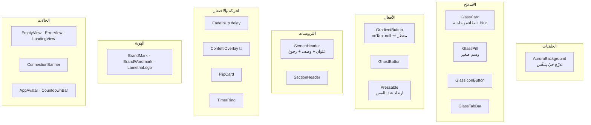
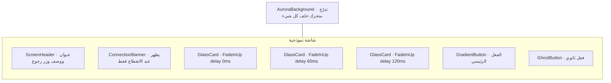

<div dir="rtl">

# نظام التصميم · UI Design System

هوية «لمّتنا» البصرية ومكوّناتها القابلة لإعادة الاستخدام.
**أي شاشة جديدة يجب أن تُبنى من هذه القطع، لا من ودجات Material خام.**

## 1. الهوية اللونية

لوحة مستوحاة من **القهوة اليمنية**: بُنّ محمّص، ذهب، أخضر برّي، وبيج ورق.

| الاسم | القيمة | الاستخدام |
|-------|--------|-----------|
| `coffee` | `#6F4E37` | اللون الأساسي · الترويسات · الأزرار الرئيسية |
| `green` | `#1F6F5B` | النجاح · الإجابة الصحيحة · «جاهز» |
| `gold` | `#D9A441` | التميّز · الفوز · الشارات · التأكيدات |
| `beige` | `#F7F0E5` | خلفية الوضع الفاتح |
| `dark` | `#121010` | خلفية الوضع الداكن |

### التدرّجات المشتقّة

```
espresso ← mocha ← coffee → latte → cream → sand
goldDeep ← gold → goldLight
greenDeep ← green → greenLight
الألوان المرحة: rose · plum · teal · amber   (لتمييز الألعاب والبطاقات)
```

| الرمز | الغرض |
|-------|-------|
| `AppGradients.gold / coffee / green / night / dayLight` | خلفيات الأزرار والبطاقات |
| `AppGradients.from(color)` | توليد تدرّج من أي لون لعبة |
| `AppColors.forSeed(key)` | لون ثابت لكل لعبة من مفتاحها |
| `AppColors.deepen() / lighten()` | اشتقاق درجات متناسقة |
| `ColorAlphaX.op(x)` | شفافية بلا `withOpacity` المهجورة |

> **قاعدة ثابتة:** لا تكتب لونًا حرفيًا (`Color(0xFF...)`) داخل الشاشات.
> كل لون يأتي من `AppColors` أو من `Theme.of(context).colorScheme`.

## 2. الخطوط

| الدور | الخط | أين |
|-------|------|-----|
| العناوين | **Baloo Bhaijaan 2** (`AppTheme.fontDisplay`) | الترويسات، الأرقام الكبيرة، الشعار |
| النصوص | **Cairo** (`AppTheme.fontBody`) | كل شيء آخر |

كلا الخطين يدعمان العربية والإنجليزية، فلا يتغيّر الشكل عند تبديل اللغة.

## 3. الأبعاد والحركة

| الرمز | القيمة | المعنى |
|-------|--------|--------|
| `AppTheme.radius` | 18 | نصف القطر الافتراضي |
| `rSm · rMd · rLg · rXl` | 12 · 18 · 24 · 32 | زوايا البطاقات والأوراق |
| `fast · medium · slow` | 150 · 280 · 520 ms | مدد الحركة |
| `ease` | `Curves.easeOutCubic` | منحنى موحّد |
| `glow(color)` | ظل ملوّن ناعم | تمييز العنصر النشط |
| `lift(isDark)` | ظل ارتفاع | البطاقات العائمة |

## 4. مكوّنات `design_kit.dart`

</div>



<div dir="rtl">

## 5. قالب الشاشة الموحّد

كل شاشة في التطبيق تتبع هذا الهيكل حرفيًا:

```dart
import '../../../core/widgets/design_kit.dart';

Scaffold(
  backgroundColor: Colors.transparent,      // الخلفية من AuroraBackground
  body: AuroraBackground(
    child: SafeArea(
      child: CustomScrollView(
        slivers: [
          SliverToBoxAdapter(
            child: ScreenHeader(
              title: l10n.t('screen_title'),
              subtitle: l10n.t('screen_subtitle'),
              accent: AppColors.green,
              onBack: () => context.pop(),
            ),
          ),
          // المحتوى في GlassCard داخل FadeInUp بتأخير متدرّج
        ],
      ),
    ),
  ),
)
```

**ممنوع:** `AppBar` تقليدي · `ScaffoldMessenger` مباشرة (استخدم `context.showSnack`) ·
نصوص حرفية (استخدم `l10n.t('key')` دائمًا) · `print` (استخدم المعالج الموحّد).

## 6. بنية الشاشة بصريًا

</div>



<div dir="rtl">

## 7. قواعد إمكانية الوصول والاتجاه

- **RTL أولًا:** لا تستخدم `left/right` إطلاقًا — استعمل `start/end` و `EdgeInsetsDirectional`.
- أصغر هدف لمس: **48×48** منطقيًا.
- تباين النص على الخلفيات الزجاجية مضمون عبر `onSurface` من الثيم، لا بألوان يدوية.
- الثيم يتبع النظام افتراضيًا، مع تجاوز يدوي من الإعدادات (`themeMode`).
- كل نص يأتي من `strings_ar.dart` / `strings_en.dart` — وعدد المفاتيح **متطابق** في الملفين.

## 8. التحقق قبل الدمج

```bash
flutter analyze                 # صفر تحذيرات
# تطابق مفاتيح الترجمة بين اللغتين
grep -oP "^\s*'\K[a-z0-9_]+(?=':)" lib/app/localization/strings_ar.dart | sort > /tmp/ar.txt
grep -oP "^\s*'\K[a-z0-9_]+(?=':)" lib/app/localization/strings_en.dart | sort > /tmp/en.txt
diff /tmp/ar.txt /tmp/en.txt && echo "✅ الترجمة متطابقة"
```

</div>
